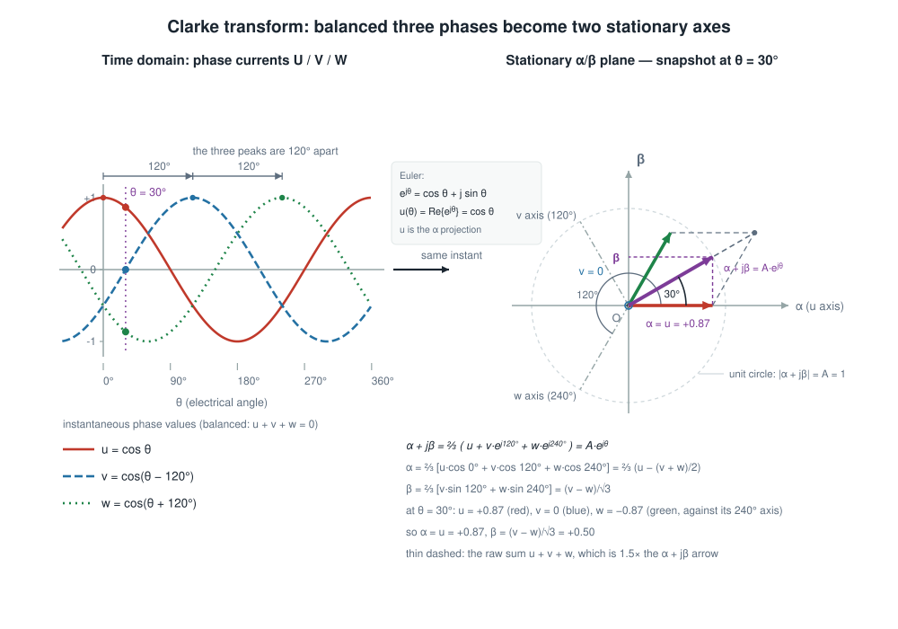

# Clarke Park Transform

Ever tried to control a brushless motor with three phase currents that all wiggle
sinusoidally at the electrical frequency? It is surprisingly painful: every
quantity you care about moves all the time, even when the machine runs at a
perfectly steady speed. The Clarke and Park transforms are the trick that turns
those three wiggling waves into two calm numbers a controller can actually work
with.

This component provides the four transforms, in `float` and in IQmath
fixed-point (twenty-one Q-formats, all usable at once), behind one friendly API.

- `clarke_park_clarke()` / `clarke_park_iclarke()`: U/V/W <-> alpha/beta
- `clarke_park_park()` / `clarke_park_ipark()`: alpha/beta <-> d/q

## What the transforms actually do

### Clarke: three phases down to two axes

A balanced three-phase system has `u + v + w = 0`, so the third value is not
free: two numbers already hold everything. The Clarke transform projects the
three phase values onto two orthogonal axes fixed to the stator, called
`alpha` and `beta`.



Both panels show the same instant, `theta = 30` degrees: three phase values 120
degrees apart in time become three vectors 120 degrees apart in the plane, one
along each phase axis, and `alpha`/`beta` are the projections of two thirds of
their sum.

Because the component uses the equal-amplitude convention, a phase amplitude of
`1` maps to a vector of length `1` in the alpha/beta plane - nice for control
loops where the amplitude is what you regulate.

### Park: follow the rotor, get nearly constant values

In the alpha/beta frame a steady motor still shows rotating vectors. The Park
transform expresses the same vector in a frame that is rotated by the rotor
electrical angle `theta`, so the two axes now spin with the rotor: `d` (direct,
along the rotor flux) and `q` (quadrature, 90 degrees ahead).


For a machine running at constant speed the `d` and `q` values become nearly
constant - which is exactly why field oriented control is built on top of these
two numbers.

### And back again

`clarke_park_iclarke()` and `clarke_park_ipark()` do the reverse, they are the
pieces a controller needs to turn its `d`/`q` commands back into phase voltages
for the inverter.

## Mathematical definitions

All transforms use the equal-amplitude convention (sometimes called the
amplitude-invariant Clarke transform): a phase peak amplitude of `1` produces a
vector of magnitude `1` in the alpha/beta plane. `theta` is the electrical angle
in radians.

Clarke transform:

$$
\begin{aligned}
\alpha &= \tfrac{2}{3}\left(u - \tfrac{v+w}{2}\right) \\
\beta  &= \tfrac{1}{\sqrt{3}}\,(v - w)
\end{aligned}
$$

Inverse Clarke transform:

$$
\begin{aligned}
u &= \alpha \\
v &= \tfrac{1}{2}\left(\sqrt{3}\,\beta - \alpha\right) \\
w &= -u - v
\end{aligned}
$$

Park transform:

$$
\begin{aligned}
d &= \alpha \cos\theta + \beta \sin\theta \\
q &= -\alpha \sin\theta + \beta \cos\theta
\end{aligned}
$$

Inverse Park transform:

$$
\begin{aligned}
\alpha &= d \cos\theta - q \sin\theta \\
\beta  &= d \sin\theta + q \cos\theta
\end{aligned}
$$

## Add the component to your project

```bash
idf.py add-dependency "espressif/clarke_park"
```

## Using the component

One set of functions handles both numeric backends. You pick the backend by the
coordinate type you pass in, nothing else changes.

### Floating point

```c
#include "clarke_park.h"

void example(float theta_rad)
{
    clarke_park_uvw_f_t uvw = { .u = 1.0f, .v = -0.5f, .w = -0.5f };
    clarke_park_ab_f_t ab;
    clarke_park_dq_f_t dq;

    clarke_park_clarke(&uvw, &ab);         // U/V/W -> alpha/beta
    clarke_park_park(theta_rad, &ab, &dq); // alpha/beta -> d/q
}
```

### IQmath fixed point

Exactly the same calls, with an `_iqN` coordinate type. There are twenty-one
formats, `_iq8` through `_iq28`, and the format is a property of the type, not of
a global setting.

```c
#include "clarke_park.h"

void example_q15(_iq15 theta_rad)
{
    clarke_park_uvw_iq15_t uvw = { .u = _IQ15(1.0f), .v = _IQ15(-0.5f), .w = _IQ15(-0.5f) };
    clarke_park_ab_iq15_t ab;
    clarke_park_dq_iq15_t dq;

    clarke_park_clarke(&uvw, &ab);
    clarke_park_park(theta_rad, &ab, &dq);
}
```

The functions are the suffixed ones (`clarke_park_clarke_iq15()`,
`clarke_park_park_iq24()`, ...). In C, the unsuffixed name is a `_Generic`
macro that picks the right one from the argument type; in C++, it is a set of
inline overloads. The dispatch is resolved at compile time, so it costs nothing
at run time and unused formats are never linked in.

### Several Q-formats in one firmware

Because the format travels with the type, a firmware can mix them freely - even
within a single translation unit:

```c
clarke_park_uvw_iq8_t uvw8 = { .u = _IQ8(1.0f), .v = _IQ8(-0.5f), .w = _IQ8(-0.5f) };
clarke_park_ab_iq8_t ab8;                /* far more range, coarser steps */

clarke_park_uvw_iq24_t uvw24 = { .u = _IQ24(1.0f), .v = _IQ24(-0.5f), .w = _IQ24(-0.5f) };
clarke_park_ab_iq24_t ab24;              /* fine steps, small range */

clarke_park_clarke(&uvw8, &ab8);
clarke_park_clarke(&uvw24, &ab24);
```

### The unsuffixed `_iq` types

`clarke_park_uvw_iq_t` and friends are aliases that follow the `GLOBAL_IQ` of
the translation unit including `clarke_park.h` (Q24 unless the application
defines `GLOBAL_IQ` itself). They are a convenience for code that already has a
single format; new code should use the explicitly suffixed types.

### The angle in the fixed-point backend

`theta` is an `_iqN` value in **radians**. The representable range is a property
of the Q-format:

| Format | Range | Note |
| --- | --- | --- |
| `_iq15` | `[-1, 1)` | Covers `[-1, 1)` rad. Enough for a full electrical revolution only up to 1 rad, so reduce the angle first. |
| `_iq24` | `[-128, 128)` | Covers more than the `[-pi, pi]` of one revolution. |

IQmath's `_IQNsin()` / `_IQNcos()` reduce the angle modulo `2*pi` internally, so
for the software backend a large angle is wrapped rather than rejected - but the
*result* of the wrapping is only meaningful if the input itself was not already
truncated by the format. Keep the angle inside the representable range of the
format you use.

The CORDIC backend does **not** depend on this. Its input window is `[-pi, pi)`
(it works in units of `pi`), so a raw Q15 angle - which spans `[-65536, 65536)`
rad - would be outside it. The backend reduces the angle to `[-pi, pi)` itself,
explicitly, before handing it to the peripheral, and does it with a 64-bit
multiply by `1/pi` in Q32 so the error does not grow with the angle. As a
result `clarke_park_park_iq15()` and `clarke_park_ipark_iq15()` accept a Q15
angle anywhere in the type's range, on either source, and agree with the
software tables to within about two Q15 LSBs. See
[the CORDIC section](#cordic-hardware-acceleration) for the numbers.

## Choosing a Q-format

| Format | Range | Resolution | When to use |
| --- | --- | --- | --- |
| Q15 | approx. +/- 1 | 3.1e-5 | Default in practice. The only format the CORDIC hardware can accelerate. |
| Q24 | approx. +/- 128 | 6.0e-8 | When you need precision over range. |
| Q8 | approx. +/- 128 | 3.9e-3 | Very large signals, coarse resolution. |

The trade-off is the usual one: more fractional bits mean finer steps and less
range. Nothing is configured globally, so you can use Q24 for your current loop
and Q15 for a speed path in the same firmware.

## CORDIC hardware acceleration

Some ESP32 chips have a CORDIC peripheral (see the
[ESP-IDF CORDIC documentation](https://docs.espressif.com/projects/esp-idf/en/latest/esp32s31/api-reference/peripherals/cordic.html)) -
`SOC_CORDIC_SUPPORTED` says whether the current target is one of them, and
`esp32s31` is the part that has it today. On those chips the `sin`/`cos` of the
Q15 Park transform can come from the hardware instead of the IQmath tables.

The CORDIC hardware works in Q15 and in Q15 only, so:

- Only `clarke_park_park_iq15()` and `clarke_park_ipark_iq15()` are affected.
- Q8..Q14, Q16..Q28 keep using the IQmath software tables. That is not a
  fallback chain: each Q-format simply has its own implementation, and only Q15
  has two.
- The float backend is never affected.
- The Clarke transforms, and the multiply/accumulate part of every Park
  transform, are unchanged - only the trigonometric evaluation moves.

### Selecting the source

`clarke_park_enable_cordic()` and `clarke_park_disable_cordic()` are part of the
API on every chip. Nothing in the build selects the hardware: the application
asks for it at run time. The CORDIC backend itself is compiled only on chips
that have the peripheral (`SOC_CORDIC_SUPPORTED`).

```c
#include "clarke_park.h"

void app_main(void)
{
    ESP_ERROR_CHECK(clarke_park_enable_cordic());
}
```

The call reserves the CORDIC engine and points the Q15 Park transform at the
hardware. The default, before any call, is the IQmath software implementation.
Call `clarke_park_disable_cordic()` to hand the unit back and return to the
tables.

Because the backend is always there on chips that have the peripheral, the
decision belongs to the application - which is the point: the CORDIC unit is
shared by the whole firmware, and only the application knows whether it is free.

`clarke_park_enable_cordic()` returns an error instead of throwing the
transform away when the hardware cannot be used. `clarke_park_disable_cordic()`
has no failure case:

| Return value | Meaning |
| --- | --- |
| `ESP_OK` | The hardware is now in use for Q15. |
| `ESP_ERR_NOT_SUPPORTED` | This chip has no CORDIC peripheral. The selection stays on the software tables. |
| `ESP_ERR_NOT_FOUND` | Another driver already owns the CORDIC unit. The selection stays on the software tables. |
| `ESP_FAIL` | The CORDIC engine could not be created for another reason. The selection stays on the software tables. |
| `ESP_ERR_INVALID_ARG` | Unknown source value. |

In every failure case the Q15 Park transform keeps working on the IQmath
software tables.

### Ownership

The CORDIC peripheral is a single hardware unit, and there is no handle anywhere
in the `clarke_park` API: `clarke_park_enable_cordic()` is the one place that
creates the engine, and the component holds it while CORDIC is enabled. If
something else created an engine first, `cordic_new_engine()` fails for the
component, the call returns `ESP_ERR_NOT_FOUND` and nothing changes for the
transforms. Calling `clarke_park_disable_cordic()` releases the engine and
hands the unit back to the rest of the firmware; calling
`clarke_park_enable_cordic()` after that re-creates it.

### Angle reduction

The peripheral computes `sin(pi * arg)` / `cos(pi * arg)` with `arg` in
`[-1, 1)`, so it only ever sees one half turn at a time. A Q15 angle, on the
other hand, spans `[-65536, 65536)` rad, which is a lot of turns.

The backend reduces the angle explicitly, before the hardware is called:

```
arg_q15 = (theta / pi) mod 2
```

`theta` is the Q15 encoding of the angle (`theta_rad = theta_q15 / 2^15`), so
`theta / pi` in Q15 units is just `theta_q15 / pi` - the `2^15` factors cancel.
The division is a multiply by `1/pi` in Q32 and the result is truncated to
16 bits, which is the modulo reduction. Reading that back as a signed 16-bit
value is exactly the `[-1, 1)` window the peripheral wants, so no branch is
needed and the cost does not depend on the angle.

#### Why not fold the angle first

IQmath also reduces the angle, but it does so with a loop, and it is worth
being explicit about why that does not transfer here.

`_IQNsin_cos.c` walks the input down to one quadrant with a fixed number of
shift-and-compare steps (`while (exp) { if (u >= iq29_pi) u -= iq29_pi;
u <<= 1; exp--; }`, 14 iterations at q = 15). Each step shifts the running
value left, so the subtraction it guards is worth `pi * 2^k`, and the loop
peels off the angle's high bits one at a time. This is cheap precisely because
the residual only has to be good enough for the following table lookup, and
because the subtraction happens at a scale where `iq29_pi` is a *full* word.

Two things break that here:

- **The period has to be accurate to about `2^-31`, not `2^-15`.** The angle
  spans 10430 turns, and the hardware argument needs the position within one
  turn. A Q15 period (`205887` for `2*pi`) is off by `0.4` per turn, so after
  10430 turns the folded angle has drifted by `0.16 rad` - about 5000 Q15 LSB,
  far more than the whole error budget. Holding the period to `2^-31` is what
  makes the multiply wide, and it is unavoidable: `2*pi` is not a power of two,
  so no shift-only fold is exact.
- **The loop then costs more than the multiply it avoids.** Counted on
  `riscv32imac` (same ISA class as the `esp32c3`/`esp32p4`, Xtensa is
  comparable for this pattern), the IQmath shape compiles to 33 instructions
  and ends in a hardware `divu`. The single wide multiply below compiles to
  two 32x32 multiplies plus about four ALU ops.

#### Where the cost actually is

The multiply is wide, but it is not expensive, because:

- the multiplier is a compile-time constant, and
- only the 16 bits at `[32, 48)` of the 48-bit product are consumed.

The compiler therefore emits `mul`/`mulh` (RISC-V) or `mull` plus one
high-word form (Xtensa), i.e. two hardware multiplies. That is the floor for
any formulation, because the carry into bit 32 is not determined by the low
32 bits of the product - so no 32-bit-only rewrite of the reduction exists.
The generated code is about 6 instructions, independent of the angle.

### Accuracy

The CORDIC engine is configured with 15 iterations, which leaves a residual of
about `2^-14` for the Q15 sin/cos - half a Q15 LSB, i.e. below the format's own
quantization step. The angle reduction adds no more than a fraction of a Q15
LSB, and does not grow with the angle. In practice the hardware and the IQmath
software tables agree to within a couple of LSBs of Q15 over the whole range of
the type. Treat the two as interchangeable numerically, and as far from
interchangeable in *cycles*: see the benchmark.

### Thread and ISR safety

| Transform | Thread safe | ISR safe |
| --- | --- | --- |
| Clarke / inverse Clarke | yes | yes |
| Park / inverse Park, software backend | yes | yes |
| Park / inverse Park, CORDIC backend | conditionally, see below | conditionally, see below |

The Clarke transforms and the software Park transforms are pure arithmetic over
their arguments: no shared state, no lock, safe to call from anywhere.

The CORDIC backend is different, and the component deliberately does not paper
over it:

- `cordic_calculate_polling()` writes the argument into the peripheral's
  registers and polls for the result. There is no lock in it, and there is only
  one hardware unit - so two contexts that are inside the CORDIC Park transform
  at the same time will corrupt each other's calculation.
- The component takes **no lock** on purpose. A lock would make the transform
  unusable from an ISR, and an FOC loop is exactly the kind of code that wants
  to run the transform from an ISR.

So the Q15 Park transform is lock free and ISR capable, and the concurrency
question is the application's to answer:

- **One context only** (the common case: everything in the control task, or all
  in the same-priority ISR): nothing to do, it just works.
- **Several contexts**: either serialise the CORDIC Park transform yourself, or
  let the control loop own it and keep other callers on the software tables.
- **Calling from an ISR**: fine, as long as no other context can be inside the
  CORDIC Park transform at that moment. Note that this is about the CORDIC path
  only - the Clarke transforms and the software Park transforms are reentrant
  because they share nothing.

`clarke_park_enable_cordic()` and `clarke_park_disable_cordic()` are not thread safe and are meant to be
called once, from one task, during start-up, with no Park transform running.

## Accuracy

| Backend | Typical error |
| --- | --- |
| float | limited by `float` precision, about 1e-7 relative |
| IQmath Q24 | about 1e-6 absolute for values in +/-1 |
| IQmath Q15 | about 1e-4 absolute (quantization step 3.1e-5) |
| IQmath Q15 + CORDIC | same as Q15, plus half an LSB of hardware residual |

## Real numbers

`examples/benchmark` counts the cycles of every transform on the target. The
timed path is placed in IRAM so the counts are not inflated by flash cache
misses. It runs on `esp32s31`, the chip with the CORDIC peripheral, and it
measures the two Q15 paths from a single binary - the switch between them is
one call to `clarke_park_enable_cordic()` or `clarke_park_disable_cordic()`:

```
--- Q15 backend (Q15 Park transform uses the IQmath software tables) ---
clarke_iq15                    11 cycles      45 ns    0.0 %
iclarke_iq15                    9 cycles      37 ns    0.0 %
park_iq15                     280 cycles    1166 ns    1.8 %
ipark_iq15                    278 cycles    1158 ns    1.7 %

--- Q15 backend (Q15 Park transform uses the CORDIC hardware) ---
clarke_iq15                    11 cycles      45 ns    0.0 %
iclarke_iq15                    9 cycles      37 ns    0.0 %
park_iq15                      42 cycles     175 ns    0.2 %
ipark_iq15                     44 cycles     183 ns    0.3 %
```

The Clarke lines are identical in both runs, which is the expected result: only
the trigonometry of the Q15 Park transform moves to the hardware. The Park lines
differ by roughly the cost of the `sin`/`cos` table lookups, which is where the
time goes.

See the [benchmark example](https://github.com/espressif/idf-extra-components/tree/master/clarke_park/examples/benchmark)
for the full output and the interpretation.

## Migrating from hand-written transforms

If you already have the classic formulas in your code, the move is mechanical:

- Replace the phase quantities with `clarke_park_uvw_*_t`, the alpha/beta pair
  with `clarke_park_ab_*_t` and the d/q pair with `clarke_park_dq_*_t`.
- Drop your `2/3`, `1/sqrt(3)` and `sqrt(3)` factors: they live in the
  component.
- For the fixed-point path, pick the `_iqN` suffix you want, convert `theta`
  with the matching `_IQN()` helper, and keep it inside the representable range.
