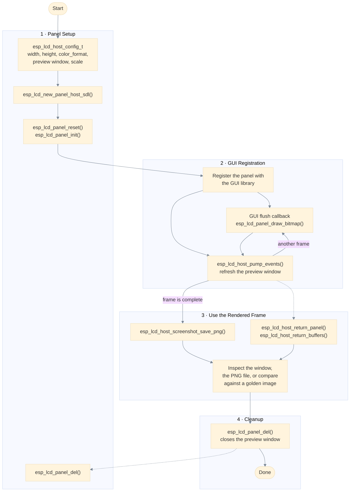

# SDL Host Panel Programming Guide

`esp_lcd_host` provides a virtual [`esp_lcd`](https://docs.espressif.com/projects/esp-idf/en/latest/esp32/api-reference/peripherals/lcd.html) panel that renders into an [SDL](https://www.libsdl.org/) window, so a GUI can be developed on a development machine without attaching a display.

The panel implements the generic `esp_lcd_panel_t` interface, the same interface that real LCD drivers, such as `esp_lcd_ili9341` or `esp_lcd_st7701`, implement. Because of that, a GUI port can be switched between a real display and the simulated one by replacing only the LCD initialization code.

## Overview

The component solves three common problems of GUI development on embedded hardware:

- **No display needed** — the GUI output is rendered into an SDL window on the host, and the same `idf.py build` builds the application.
- **GUI code stays portable** — the panel speaks `esp_lcd`, so the LVGL flush callback and the display driver registration do not change.
- **Frames can be verified automatically** — the panel content can be saved as a PNG file and compared against a golden image in CI.

The panel keeps a full-size copy of the pixels submitted by the GUI. Rotation, gap, mirroring and color inversion are not applied to that copy, in the same way that they are not applied to the preview window.

## API Usage Workflow

The diagram below shows the lifecycle of an application built on the SDL host panel. The **panel setup** stage replaces the LCD initialization of the board, **GUI registration** is the part that stays unchanged between a real display and the simulation, and the **frame export** stage makes the rendered content visible and testable.



## SDL

The component vendors SDL3 as the git submodule [`esp_lcd_host/SDL`](https://github.com/libsdl-org/SDL) and builds it with the CMake project SDL ships, through `add_subdirectory()` in `port/sdl/CMakeLists.txt`. Reusing the project of SDL keeps the source lists of the library and its build configuration header in sync with the submodule: nothing has to be copied or re-listed here.

Before adding the subdirectory, the port turns off everything an LCD panel does not need and fixes the few results SDL would otherwise probe from the machine running CMake, so the build is small and reproducible:

| Enabled | Description |
| --- | --- |
| Video, events, threads, timer, filesystem, storage | The SDL core the panel and the preview window rely on. |
| Software renderer | Straightforward and dependency free, which is enough for a preview. |
| OpenGL ES (EGL only) | SDL only probes for EGL when OpenGL or OpenGL ES is on, and the KMSDRM driver cannot be built without EGL, so OpenGL ES stays on for the KMSDRM case alone. The panel never selects its render driver. |
| X11 and Wayland video drivers | Probed and enabled by default, so the preview window opens on a normal desktop: Wayland natively in a Wayland session, X11 in an X11 session and under XWayland. Each one is compiled in only when the build machine has its development packages, and the port probes the X11 packages on its own so that an incomplete set leaves the driver out instead of stopping the configuration. |
| KMSDRM video driver | Used when `libdrm`, `gbm` and EGL are present, so the preview window appears on a local console. |
| Dummy and offscreen video drivers | Always available, so a headless machine and CI keep working without a display. |

Audio, camera, joystick, haptic, hidapi, sensor, power, dialog, tray and GPU are off, and so are the GPU and board video drivers. The optional dependencies SDL would otherwise pick up from whatever is installed on the build machine (Fribidi, libthai, D-Bus, IBus, libudev, liburing) are off as well, together with the platform checks behind them. SDL generates `SDL_build_config.h` from its own template during the build, so the port does not carry a hand written configuration.

The dynamic API of SDL is left at the SDL default. It is meant for swapping the SDL library at run time, and this port links SDL statically into the application, so it is inert here.

Two files of the port are worth knowing about:

| File | Purpose |
| --- | --- |
| `port/sdl/CMakeLists.txt` | Sets the SDL options and the fixed check results, then adds the SDL submodule. |
| `port/src/sdl_port_stubs.c` | Holds the few definitions SDL wants from parts this port does not build. |

## Prerequisites

- The ESP-IDF host (`linux`) target, ESP-IDF `>= 6.0.0`.
- The checkout of the `esp_lcd_host/SDL` submodule for the sources of SDL.
- For a preview window on a desktop, the development packages of the display server, which SDL probes for. Neither is mandatory, and both can be turned off with `-DESP_LCD_HOST_SDL_X11=OFF` / `-DESP_LCD_HOST_SDL_WAYLAND=OFF`:

  | Driver | Debian/Ubuntu packages |
  | --- | --- |
  | Wayland | `libwayland-dev wayland-protocols libxkbcommon-dev libegl-dev` |
  | X11 | `libx11-dev libxext-dev` |

  The libraries are loaded with `dlopen()` at run time, so they are needed to build, not to run. When the X11 packages are incomplete the X11 driver is left out of the build, it is not an error.
- For a preview window on a local console: `libdrm`, `gbm` and `libegl`. SDL also needs EGL for the KMSDRM driver, which is why the port keeps the EGL check of SDL on.
- Without any of these SDL keeps the dummy and offscreen video drivers, and the panel works as a framebuffer that is exported as a PNG file.

## Configuration

The panel is configured with `esp_lcd_host_config_t` at initialization time:

| Field | Description |
| --- | --- |
| `width`, `height` | Panel resolution. `draw_bitmap()` calls are clipped to this rectangle. |
| `color_format` | Pixel layout the GUI submits, as an `esp_color_fourcc_t`, for example `ESP_COLOR_FOURCC_BGR24` for LVGL RGB888 or `ESP_COLOR_FOURCC_RGB16` for RGB565. |
| `create_window` | Opens an SDL preview window. Leave it `false` on machines without a display, for example in CI. |
| `scale` | Integer upscale factor of the preview window. The window surface is the panel framebuffer, so SDL scales it and no extra buffer is needed. |
| `window_title` | Preview window title, a default is used when `NULL`. |

The configuration is stored per panel, so several panels with different resolutions and color formats can coexist, and an export always uses the geometry of its own panel.

## Color formats

The fourcc values follow the `esp_color_fourcc_t` encoding of ESP-IDF and are packed little-endian: the first character is the least significant byte.

| FourCC | Description |
| --- | --- |
| `RGB16` | RGB565, little-endian `uint16_t` |
| `RGB16_BE` | RGB565, big-endian |
| `RGB24` | RGB888, bytes in R, G, B order |
| `BGR24` | RGB888, bytes in B, G, R order (LVGL RGB888 and most ESP-IDF RGB888 paths) |
| `ARGB8888`, `ABGR8888`, `RGBA8888`, `BGRA8888` | 32bpp with alpha, in the byte order given by the name |

PNG export always produces 8 bits per channel. For 32bpp formats an all-zero alpha channel is treated as opaque, so an XRGB8888 frame does not end up fully transparent.

## Frame export

- `esp_lcd_host_screenshot_save_png()` writes the panel content as a PNG file. Colors are converted scanline by scanline and handed to libpng with `png_write_row()`, so no extra full-frame RGB buffer is allocated.
- `esp_lcd_host_return_panel()` and `esp_lcd_host_return_buffers()` publish the latest frame. The SDL backend renders the framebuffer of the panel itself, so the calls only validate the handle; a GUI port keeps them for a single code path.

Export and publish the panel content only after the GUI finished the frame you want, because as with any `esp_lcd` panel a frame can consist of several partial flushes.

## Preview window

The preview window shows the panel framebuffer directly, so submitting a frame copies nothing. `esp_lcd_host_pump_events()` refreshes the window surface, but only after the GUI has drawn something, because `SDL_UpdateWindowSurface()` is synchronous and would otherwise steal time from the GUI.

Applications must call `esp_lcd_host_pump_events()` periodically while a preview window is open. On the ESP-IDF host target the LVGL timer handler is a convenient place:

```c
static void example_lv_timer_cb(lv_timer_t *timer)
{
    lv_tick_inc(EXAMPLE_LV_TICK_PERIOD_MS);
    lv_timer_handler();
    ESP_ERROR_CHECK(esp_lcd_host_pump_events());
}
```

An application without an LVGL task pumps the window from its own loop, which is what the example does before it exports the frame.

## Target detection

`esp_lcd_host_get_target()` reports what the panel runs on. The component only builds for the ESP-IDF host (`linux`) target, so the call always reports `ESP_LCD_HOST_TARGET_POSIX` here. It is useful for code that wants to adapt the simulation, for example to slow down animation ticks so the frames stay readable:

```c
esp_lcd_host_target_t target = ESP_LCD_HOST_TARGET_ESP32;
ESP_ERROR_CHECK(esp_lcd_host_get_target(panel, &target));
if (target == ESP_LCD_HOST_TARGET_POSIX) {
    // Running in the simulation, use a slower animation period.
}
```

## Limitations

- The component only supports the `linux` target. Use the `esp_lcd_*` panel driver of the display controller for a real chip.
- The panel never blocks: `draw_bitmap()` copies the pixels and returns. A GUI that relies on the transfer-done callback of a real panel should not expect an asynchronous notification.
- The exported image shows the pixels submitted by the GUI, before any rotation, gap, mirroring or color inversion is applied.
- 16bpp formats are exported through the RGB565 to RGB888 expansion, which loses precision.
- A preview window needs a display: SDL opens it through its X11 or Wayland driver on a desktop and through KMSDRM on a local console. Without a display, or in a build that turned the X11 and Wayland drivers off, SDL window creation fails and the panel continues to work as a framebuffer only.
